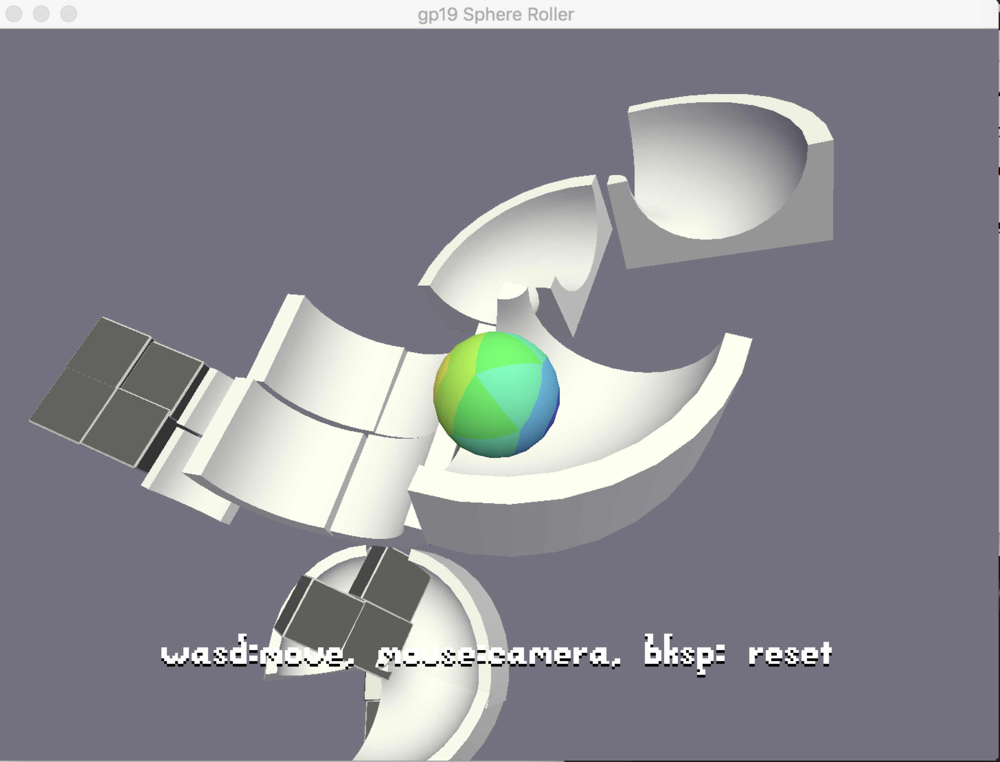

Vertical Mazz

Author: Xuechun Luo

Design:
A vertical mazz where you need to find your own way to reach the destination. No rules for how to reach the destination try jump between different objects 

Screen Shot:

How To Play:

Use W S A D to control your ball. You can try to find your own way to reach the destination.

Sources:

(TODO: fill in information about the sources of any **artwork** or **sounds** you used in the game that you did not create yourself. Feel free to also credit yourself for things you did make.)

This game was built with [NEST](NEST.md).
